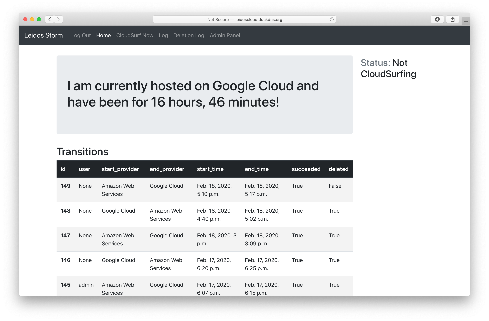

# CS03 Main Repository

## Leidos Storm

This application automatically moves itself and its data securely across cloud providers, depending on the share price changes of providers. The purpose of the application is to show that movement across cloud providers while securely transferring the data they use to function is possible. Share price will be the criteria that decides movement due to the fact that share prices regularly fluctuate, and this will allow regular movements between providers to take place.

##### [Documentation is available here](https://docs.google.com/document/d/e/2PACX-1vTI_e-BRCgW3V2SCpauVSDxyUhvtRhRFpeiT990QDiQEbMPAdm_COyR9vM83rMyxXGeWctCZxNHSJzR/pub)

## Release Notes
### Version 1.1.1
##### March 11, 2020
- Code commenting adjusted

##### Known Issues
- Prediction feature is fake and a shell for a feature which can be explored more later

### Version 1.1.0
##### March 4, 2020
- Prediction feature is added
- Reliability bug fixed. The system can now once again automatically recover from eror
- Admin page bug fixed. The system will no longer display errors when opening the "stock datas" page

##### Known Issues
- Prediction feature is fake and a shell for a feature which can be explored more later

### Version 1.0.1
##### Feburary 26, 2020
- Code layout is cleaner
- Log out button is moved to a more sensible place
- Color is added!

##### Known Issues
- None

### Version 1.0.0
##### February 19, 2020
- First feature complete MVP release
- Will move itself automatically across cloud providers
- Shows basic status information and history to user

##### Known Issues
- None
